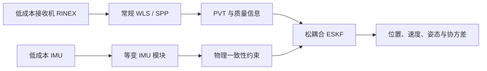

# 无高精度轨迹监督的等变物理约束 GNSS/INS 融合

RTK-Free Equivariant Physics-Informed GNSS/INS Fusion

本项目面向城市峡谷和 GNSS 退化环境，研究如何只使用常规 WLS/SPP 定位结果和低成本 IMU，得到连续、稳定并带有可信不确定度的融合轨迹。

项目目前处于理论和方法设计阶段，下面的内容是当前研究方案，不代表已经得到实验验证。

## 研究目标

- 不使用高精度轨迹参与训练、调参和模型选择；
- 用等变网络处理 IMU 中的旋转几何关系；
- 用独立的物理残差约束惯性运动；
- 由显式 ESKF 输出位置、速度、姿态和协方差；
- 重点考察城市 GNSS 退化条件下的稳定性、泛化能力和不确定度质量。

本项目不会把 IMU 和 SPP 直接回归绝对位置作为默认方案。公共 SPP 偏差在缺少独立绝对信息时可能无法观测，这也是后续实验需要明确面对的限制。

## 方法思路

主数据链从低成本接收机 RINEX 生成常规 WLS/SPP 结果，再与低成本 IMU 一起进入松耦合 ESKF。学习模块主要负责估计量测质量、惯性先验和噪声尺度，最终导航状态仍由 ESKF 给出。



GNSS 分支会从简单规则开始，再比较 TCN、GRU 和轻量因果 Transformer。IMU 分支会先建立普通非等变基线，再加入物理约束，最后比较重力感知的等变结构。只有各部分能够单独辨识后，才考虑联合调整过程噪声、量测噪声和 IMU 偏差。

## 当前进展

- Phase 0 已完成：建立项目目录、运行环境、基础代码结构和测试；
- Phase 1 正在进行：整理状态定义、坐标系、群作用、物理残差、训练目标和评测方案；
- 尚未下载正式数据，也没有开始模型训练；
- 目前没有可以报告的定位性能结果。

## 研究路线

1. 理论、文献和方法规格；
2. 官方数据与常规 WLS/SPP；
3. SPP、INS 和确定性 ESKF 基线；
4. 普通非等变的物理约束与自监督基线；
5. 等变 IMU 模块与公平对比；
6. 完整模型、消融和跨场景实验；
7. 最终精度评测、复现整理和论文写作。

## 项目结构

```text
config/        阶段配置
docs/          研究设计与项目记录
requirements/  依赖锁定文件
scripts/       检查与运行脚本
src/           项目源码
tests/         自动化测试
科研手记.md     阶段研究记录
```

## 本地运行

项目保存在 Windows 的 `E:\rtkfree-equivariant-gnss-ins`，通过 Ubuntu-24.04 WSL 运行：

```bash
cd /mnt/e/rtkfree-equivariant-gnss-ins
bash scripts/healthcheck.sh
```

当前阶段使用 Python 3.12，暂时没有第三方运行依赖。后续加入科学计算和深度学习库时会同步更新环境说明。

## 研究记录

阶段进展记录在 [科研手记.md](科研手记.md)。手记只简要记录实际完成的工作，不作为实验结果或论文结论。

## License

仓库可以公开查看，但不是开源项目。代码保留所有权利，具体说明见 [LICENSE.md](LICENSE.md)。
