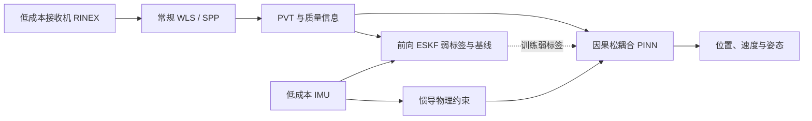

# 无高精度轨迹监督的等变物理约束 GNSS/INS 融合

RTK-Free Equivariant Physics-Informed GNSS/INS Fusion

本项目面向城市峡谷和 GNSS 退化环境，研究不使用高精度轨迹监督的松耦合 GNSS/INS 融合。系统以常规 WLS/SPP PVT 和低成本 IMU 为输入，使用实时前向 ESKF 提供训练弱标签和传统基线，再由因果 PINN 递归输出位置、速度和姿态。可信预测不确定度作为均值状态稳定后的后续扩展。

项目目前已完成理论设计、数据整理、常规 SPP、确定性 GNSS/INS 基线，以及第一套普通非等变因果学生的有/无物理残差开发比较。该比较只使用弱伪标签和无参考诊断，不能支持定位精度或优越性结论。

## 研究目标

- 不使用高精度轨迹参与训练、调参和模型选择；
- 用等变网络处理 IMU 中的旋转几何关系；
- 用独立的物理残差约束惯性运动；
- 使用实时前向 ESKF 生成训练伪标签并作为传统基线，由因果 PINN 输出最终导航状态；
- 重点考察城市 GNSS 退化条件下的稳定性和泛化能力；若后续加入预测协方差，再单独评估其不确定度质量。

本项目不会把 IMU 和 SPP 直接回归绝对位置作为默认方案。公共 SPP 偏差在缺少独立绝对信息时可能无法观测，这也是后续实验需要明确面对的限制。

## 方法思路

主数据链从低成本接收机 RINEX 生成常规 WLS/SPP 结果，再与低成本 IMU 组成松耦合输入。实时前向 ESKF 在训练阶段提供不依赖 RTK 的弱伪标签，并作为传统方法基线；部署时由因果 PINN 递归输出最终导航状态。


```mermaid
flowchart LR
    RINEX["低成本接收机 RINEX"] --> SPP["常规 WLS / SPP"]
    SPP --> GNSS["PVT 与质量信息"]
    IMU["低成本 IMU"] --> Physics["惯导物理约束"]
    GNSS --> ESKF["前向 ESKF 弱标签与基线"]
    IMU --> ESKF
    ESKF -. 训练弱标签 .-> PINN
    GNSS --> PINN["因果松耦合 PINN"]
    Physics --> PINN
    PINN --> State["位置、速度与姿态"]
```

项目先建立普通非等变的松耦合基线，再加入独立物理残差，最后比较普通网络、旋转增强和重力感知的 `SO(2)` 等变结构。紧耦合、完整预测协方差和更多时序分支只有在主线稳定且确有必要时才会继续研究。

## 当前进展

- Phase 0 已完成：建立项目目录、运行环境、基础代码结构和测试；
- Phase 1 已完成：确定了状态与坐标系、弱标签信息流、独立物理残差、`SO(2)` 作用和最小评测方案；
- Phase 2 已完成：整理了 UrbanNav 的 RINEX 与低成本 IMU，并冻结了可重复生成的常规 GPS 单点定位和标准化数据接口；
- Phase 3 已完成：建立了 SPP-only、纯 INS、固定前向 ESKF 和可重复的 20/30 秒 GNSS 中断基线；
- Phase 4 已完成：建立了普通非等变因果递归学生和匹配的 no-physics / physics 开发比较，物理项在本次独立诊断中没有显示正收益；
- 下一步进入 Phase 5，研究重力感知的 `SO(2)` 等变 IMU 模块，并与普通网络和旋转增强进行公平比较；
- 正式数据、模型权重、训练日志和运行结果均保存在仓库外；
- 目前没有可以报告的定位性能结果。

## 研究路线

1. 理论、文献和方法规格；
2. 官方数据与常规 WLS/SPP；
3. SPP、INS 和确定性 ESKF 基线；
4. 普通非等变的 ESKF 伪标签弱监督与物理约束基线；
5. 等变 IMU 模块与公平对比；
6. 完整模型、消融和跨场景实验；
7. 最终精度评测、复现整理和论文写作。

## 项目结构

```text
config/        阶段配置
docs/          研究设计与项目记录
requirements/  依赖锁定文件
scripts/       检查与运行脚本
src/           项目源码
tests/         自动化测试
```

## 本地运行

项目保存在 Windows 的 `E:\rtkfree-equivariant-gnss-ins`，通过 Ubuntu-24.04 WSL 运行：

Phase 3 的确定性基线可在其仓库外锁定环境中单独复查：

```bash
cd /mnt/e/rtkfree-equivariant-gnss-ins
python3.12 -m venv ~/rtkfree-venvs/phase3
~/rtkfree-venvs/phase3/bin/python -m pip install \
  -r requirements/phase3.lock
source ~/rtkfree-venvs/phase3/bin/activate
```

当前完整检查使用仓库外的 Phase 4 CPU-only 锁定环境：

```bash
cd /mnt/e/rtkfree-equivariant-gnss-ins
python3.12 -m venv ~/rtkfree-venvs/phase4
~/rtkfree-venvs/phase4/bin/python -m pip install \
  -r requirements/phase4.lock
source ~/rtkfree-venvs/phase4/bin/activate
bash scripts/healthcheck.sh
```

Phase 0 核心仍无第三方运行依赖；Phase 3 仅增加锁定的 NumPy 2.5.2；Phase 4 增加锁定的 CPU-only PyTorch 2.13.0 及其最小传递依赖。未引入 CUDA、训练平台或大型导航框架。

## License

仓库可以公开查看，但不是开源项目。代码保留所有权利，具体说明见 [LICENSE.md](LICENSE.md)。
